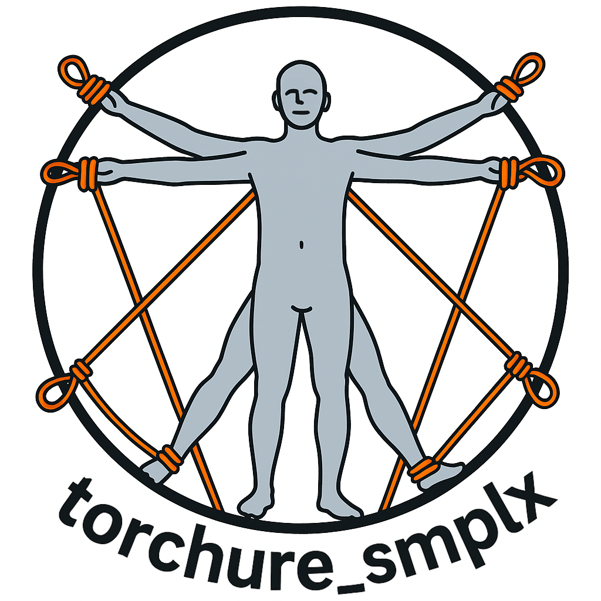

<h1 align="center">torchure_smplx</h1>
<p align="center">
  
</p>

A high-performance C++ implementation of the [SMPL](https://smpl.is.tue.mpg.de/), SMPL-H, and SMPL-X body models using [LibTorch](https://pytorch.org/cppdocs/). Optimized for GPU execution, capable of running up to **1000 inferences per second**. 
This implementation is a refined and improved version of [smpl-cpp](https://github.com/Arktische/smpl-cpp). It also includes a Torch Chamfer Distance implementation in and a fitting example that can be used to fit the SMPL model to point clouds as well as a Visualization example using Open3D.

<table align="center">
<tr>
<td><b>Fast Fitting </br>(predicting betas) </b></td>
<td><b>Fast Fitting </br>(predicting betas and pose)</b></td>
</tr>
<tr>
<td>

</td>
<td>

</td>
</tr>
</table>


---

## 🚀 Features

- C++ implementation using LibTorch (PyTorch C++ API)
- Supports SMPL, SMPL-H (TODO), and SMPL-X (TODO) models
- GPU acceleration via CUDA (optional)
- Suitable for real-time performance-critical applications
- Fast model loading using NumPy `.npz` format (no Python runtime required)
- Fast fitting to point clouds using Chamfer Distance
- Easy integration with other systems since it produces a portable `smplx` library
- Visualization example using Open3D

---

## 📦 Installation

### 1. Clone the repository

```bash
git clone https://github.com/hydran00/torchure_smplx.git
cd torchure_smplx
```

---

### 2. Install dependencies

- [LibTorch](https://pytorch.org/get-started/locally/)
- [Zlib](https://zlib.net/) (often pre-installed) or with `sudo apt install zlib1g-dev`
- CMake
- CUDA (optional, for GPU builds)
- Open3D (optional, for visualization)

Download the correct LibTorch version for your platform and CUDA version from [https://pytorch.org](https://pytorch.org).

---

### 3. Configure and build
#### PyTorch users
⚠️ *If you rely on pip's PyTorch package, check with which API it was built. Some Pytorch implementations are built with the deprecated Pre-CXX ABI support, which makes them incompatible with many libraries like Open3D, you can check if with*
```bash
python -c "import torch; print('PyTorch ABI:', torch._C._GLIBCXX_USE_CXX11_ABI)"  # should print True
``` 
If it prints `False` I suggest you to download LibTorch(refer to Libtorch section) or chose a compatible PyTorch version.
Then determine your Torch cmake path:

```bash
python -c "import torch; print(torch.utils.cmake_prefix_path)"
```
#### LibTorch users (recommended)
Download the C++ version of LibTorch from [PyTorch's official site](https://pytorch.org/get-started/locally/) and extract it. Make sure to choose the version that matches your system architecture and CUDA version (if applicable). You Torch cmake path should look like this:

```bash
/path/to/libtorch/share/cmake/Torch
```

#### (Optional) Enable CUDA

If you want GPU acceleration, set the `CUDACXX` variable to point to `nvcc`, in Linux the path is usually `/usr/local/cuda/bin/nvcc`.

```bash
export CUDACXX=/usr/local/cuda/bin/nvcc
```

#### Building the project
Then configure and build:

```bash
mkdir build
cd build
cmake .. -DCMAKE_PREFIX_PATH="<torch cmake prefix path>"
make
```

*Optional: To link Torch you can also set the same `Torch_DIR` variable in CMake, so you can avoid expliciting Torch_DIR every time*

```bash
# add this line to on top of CMakeLists.txt
set(Torch_DIR "<torch cmake prefix path>")
```
---


Make sure your LibTorch download matches your CUDA version.

---

### 🌀 Convert `.pkl` models to `.npz`

This project uses `.npz` format for loading SMPL/SMPL-X models in C++. Convert the official `.pkl` models using the included Python script:

```bash
python3 pkl2npz.py \
  smpl/models/basicModel_f_lbs_10_207_0_v1.0.0.pkl \
  smpl/models/basicModel_m_lbs_10_207_0_v1.0.0.pkl
```

This will produce `.npz` files compatible with C++ using the cnpy loader.

---

### 📘 Run the examples

#### ⏱️ Benchmark the SMPL model
```bash
./benchmark <path-to-converted-smpl-model.npz>
```

This runs the model and outputs a mesh for a single forward pass. Performance on GPU can reach ~1000 FPS depending on hardware.

### 🧍 Fitting SMPL with C++ Chamfer Distance
```
./fitting <path-to-converted-smpl-model.npz>
```
This example will also open a Open3D window to visualize the fitting process if Open3D was available during the building process.
---

## 📜 License

Apache 2.0 License (see `LICENSE` file).

---

## 🙋‍♂️ Support

Please open an issue or PR on [GitHub](https://github.com/hydran00/torchure_smplx) if you need help or want to contribute.


## 📑 References
[smpl-cpp](https://github.com/Arktische/smpl-cpp): Libtorch implementation of SMPL, base code of this project.  
[cnpy](https://github.com/rogersce/cnpy): A C++ library for loading NumPy `.npz` files.  
[chamferdist](https://github.com/krrish94/chamferdist): Torch implementation of Chamfer Distance.  
[smplx](https://github.com/vchoutas/smplx): SMPL-X repository.